<!-- 

Detalles
Objetivo: Familiarizar a los estudiantes con la administración de usuarios, grupos y permisos en un sistema operativo Linux.
Requisitos previos: Tener instalado un sistema Linux y acceso al terminal.
Envio: Enviar Link al folder actividad3 de su repositorio de GitHub
Instrucciones
Crear un md file y resolver cada uno de los items solicitados a continución. Debe de colocar el comando utilizado asi como el resultado si este fuera necesario. 

Parte 1: Gestión de Usuarios
1. Creación de Usuarios: Crea tres usuarios llamados `usuario1`, `usuario2` y `usuario3`.

2. Asignación de Contraseñas: Establece una nueva contraseñas para cada usuario creado.

3. Información de Usuarios: Muestra la información de `usuario1` usando el comando `id`.

4. Eliminación de Usuarios: Elimina `usuario3`, pero conserva su directorio principal.

Parte 2: Gestión de Grupos
1. Creación de Grupos: Crea dos grupos llamados `grupo1` y `grupo2`.

2. Agregar Usuarios a Grupos: Agrega `usuario1` a `grupo1` y `usuario2` a `grupo2`.

3. Verificar Membresía: Verifica que los usuarios han sido agregados a los grupos utilizando el comando `groups`.

4. Eliminar Grupo: Elimina `grupo2`.

Parte 3: Gestión de Permisos
1. Creación de Archivos y Directorios:

Como `usuario1`, crea un archivo llamado `archivo1.txt` en su directorio principal y escribe algo en él.
Crea un directorio llamado `directorio1` y dentro de ese directorio, un archivo llamado `archivo2.txt`.
2. Verificar Permisos: Verifica los permisos del archivo y directorio usando el comando `ls -l` y `ls -ld` respectivamente.

3. Modificar Permisos usando `chmod` con Modo Numérico: Cambia los permisos del `archivo1.txt` para que sólo `usuario1` pueda leer y escribir (permisos `rw-`), el grupo pueda leer (permisos `r--`) y nadie más pueda hacer nada.

4. Modificar Permisos usando `chmod` con Modo Simbólico: Agrega permiso de ejecución al propietario del `archivo2.txt`.

5. Cambiar el Grupo Propietario: Cambia el grupo propietario de `archivo2.txt` a `grupo1`.

6. Configurar Permisos de Directorio: Cambia los permisos del `directorio1` para que sólo el propietario pueda entrar (permisos `rwx`), el grupo pueda listar contenidos pero no entrar (permisos `r--`), y otros no puedan hacer nada.

7. Comprobación de Acceso: Intenta acceder al `archivo1.txt` y `directorio1/archivo2.txt` como `usuario2`. Nota cómo el permiso de directorio afecta el acceso a los archivos dentro de él.

8. Verificación Final: Verifica los permisos y propietario de los archivos y directorio nuevamente con `ls -l` y `ls -ld`.

Reflexión: (Opcional)
Contestar las siguientes preguntas:

¿Por qué es importante gestionar correctamente los usuarios y permisos en un sistema operativo?
¿Qué otros comandos o técnicas conocen para gestionar permisos en Linux? 
-->


# Actividad 3

## Parte 1: Gestión de Usuarios

### 1. Creacion de Usuarios

Creando los usuarios `usuario1`, `usuario2` y `usuario3`.

```bash
# Creacion de usuario1
sudo useradd -m usuario1

# Creacion de usuario2
sudo useradd -m usuario2

# Creacion de usuario3
sudo useradd -m usuario3
```


### 2. Asignación de Contraseñas
Asignando las contraseñas para cada usuario.

```bash
# Contraseña para usuario1 = usuario1
sudo passwd usuario1

# Contraseña para usuario2 = usuario2
sudo passwd usuario2

# Contraseña para usuario3 = usuario3
sudo passwd usuario3
```


### 3. Información de Usuarios
Mostrando la información de `usuario1` usando el comando `id`.
<!-- EJECUTAR EN UBUNTU WSL -->
```bash
id usuario1
```
<!-- RESULTADO -->
`Resultado:`
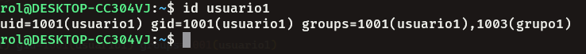


### 4. Eliminación de Usuarios
Eliminación de `usuario3`, pero conservando su directorio principal.

```bash
sudo userdel usuario3
```
`Resultado sin aparecer en el cat de passwd:`
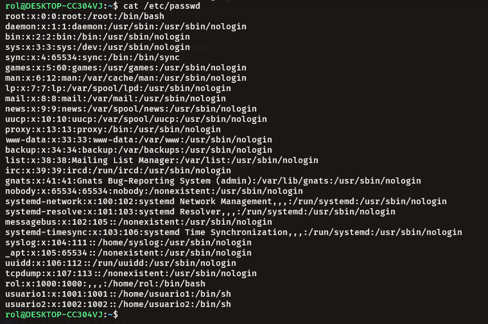


---


## Parte 2: Gestión de Grupos

### 1. Creación de Grupos
Creando los grupos `grupo1` y `grupo2`.

```bash
# Creacion del grupo1
sudo groupadd grupo1

# Creacion del grupo2
sudo groupadd grupo2
```


### 2. Agregar Usuarios a Grupos
Agregando `usuario1` a `grupo1` y `usuario2` a `grupo2`.

```bash
# Agregar usuario1 al grupo1
sudo usermod -aG grupo1 usuario1

# Agregar usuario1 al grupo2
sudo usermod -aG grupo2 usuario2
```


### 3. Verificar Membresía
Verificar que los usuarios han sido agregados a los grupos utilizando el comando `groups`.

```bash
groups usuario1
```

```bash
groups usuario2
```

`Resultados:`

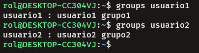


### 4. Eliminar Grupo
Eliminación de `grupo2`.

```bash
sudo groupdel grupo2
```
`Resultado:`

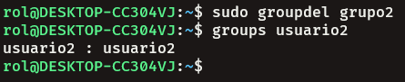


---

## Parte 3: Gestión de Permisos

### 1. Creación de Archivos y Directorios

Primero cambiar al usuario1
<!-- Contraseña = usuario1 -->
```bash
# Cambiar a usuario1
su - usuario1
```

# Crear archivo1.txt y escribir algo en él
```bash
echo "Contenido del archivo1 del usuario1" > ~/archivo1.txt
```

# Crear directorio1 y archivo2.txt dentro de él
```bash
mkdir ~/directorio1
echo "Contenido del archivo2 del usuario1" > ~/directorio1/archivo2.txt
```

`Resultado:`

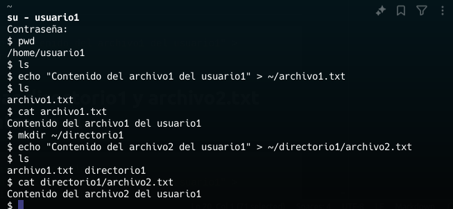


### 2. Verificar Permisos
Verificando los permisos del archivo y directorio usando el comando `ls -l` y `ls -ld` respectivamente.

```bash
ls -l 
```
```bash
ls -ld
```

`Resultado:`


### 3. Modificar Permisos usando `chmod` con Modo Numérico
Cambiando los permisos del `archivo1.txt` para que sólo `usuario1` pueda leer y escribir (permisos `rw-`), el grupo pueda leer (permisos `r--`) y nadie más pueda hacer nada.

```bash
chmod 640 ~/archivo1.txt
```

`Verificando los permisos:`
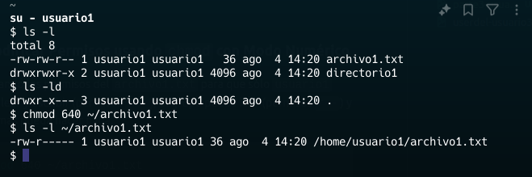


### 4. Modificar Permisos usando `chmod` con Modo Simbólico
Agregando permiso de ejecución al propietario del `archivo2.txt`.

```bash
chmod u+x ~/directorio1/archivo2.txt
```
`Verificando los permisos:`
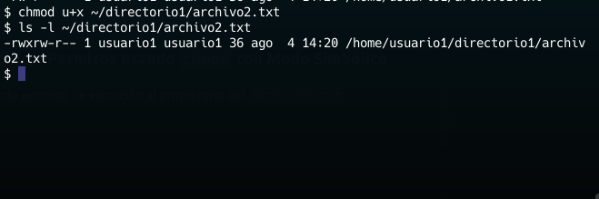


### 5. Cambiar el Grupo Propietario
Cambiando el grupo propietario de `archivo2.txt` a `grupo1`.

```bash
chown :grupo1 ~/directorio1/archivo2.txt
```
`Verificando los permisos:`
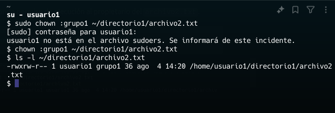


### 6. Configurar Permisos de Directorio
Cambiando los permisos del `directorio1` para que sólo el propietario pueda entrar (permisos `rwx`), el grupo pueda listar contenidos pero no entrar (permisos `r--`), y otros no puedan hacer nada.

```bash
chmod 744 ~/directorio1
```
`Verificando los permisos:`
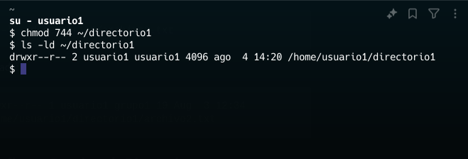


### 7. Comprobación de Acceso
Intentando acceder al `archivo1.txt` y `directorio1/archivo2.txt` como `usuario2`. Nota cómo el permiso de directorio afecta el acceso a los archivos dentro de él.

```bash
# Cambiar a usuario2
su - usuario2

cat /home/usuario1/archivo1.txt

cat /home/usuario1/directorio1/archivo2.txt

```
`Resultado:`
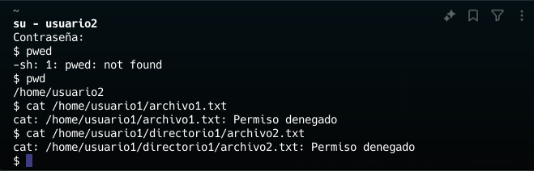
> **Nota:**
> Efectivamente los permisos dentro del directorio no me dejan acceder al archivo2.txt


### 8. Verificación Final
Verificando los permisos y propietario de los archivos y directorio nuevamente con `ls -l` y `ls -ld`.

`Resultado:`
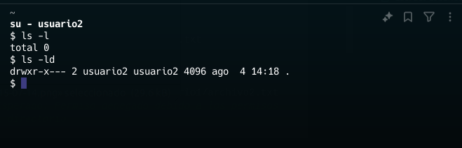


---
## Reflexión

    ¿Por qué es importante gestionar correctamente los usuarios y permisos en un sistema operativo?

**Respuesta:**  
Para proteger los archivos y asegurarse de que ningún otro usuario o grupo tenga acceso a estos sin la debida autorización. Además, esto protege a los usuarios de modificar contenido que pueda ser sensible y del cual no tengan conocimiento.


    ¿Qué otros comandos o técnicas conocen para gestionar permisos en Linux?

- **chmod**: Cambia los permisos de archivos y directorios.
- **chown**: Cambia el propietario y el grupo de archivos y directorios.
