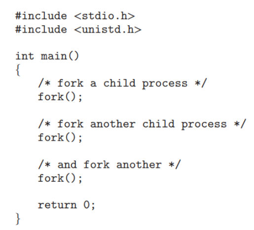
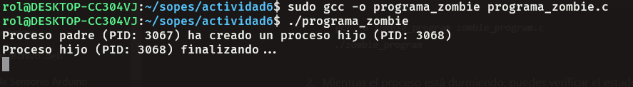
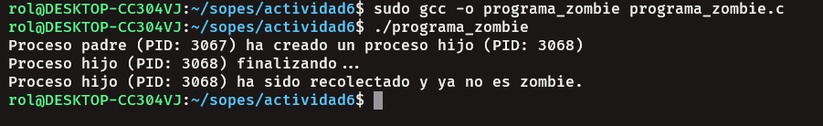
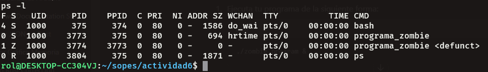
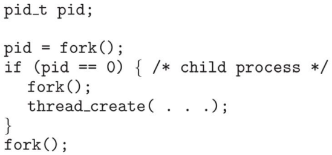

# Actividad 6

## 1. ¿Incluyendo el proceso inicial, cuantos procesos son creados por el siguiente programa?
Razone su respuesta. 



> ### Respuesta:
>
>Se crean aproximadamente 8 procesos. Cada llamada a la función **fork()** genera un proceso hijo y permite que el proceso padre continúe su ejecución. El segundo **fork()** duplica el número de procesos, creando 2 nuevos por cada uno existente. Finalmente, el tercer **fork()** añade 4 procesos más, ya que los procesos creados previamente actúan como padres. En total, se terminan generando 8 procesos.


## 2. Utilizando un sistema Linux, escriba un programa en C que cree un proceso hijo (fork) que finalmente se convierta en un proceso zombie. 

El proceso zombie debe permanecer en el sistema durante al menos 60 segundos. Los estados del proceso se pueden visualizar con el comando `ps -l`.


### Codigo:
```C
#include <stdio.h>
#include <unistd.h>
#include <sys/types.h>
#include <sys/wait.h>
#include <stdlib.h>

int main() {
    pid_t pid = fork();  // Crea un nuevo proceso hijo

    if (pid < 0) {
        // Si `fork()` falla, imprimimos un error
        perror("El Fork Fallo");
        return 1;
    }

    if (pid == 0) {
        // Este bloque es ejecutado por el proceso hijo
        printf("Proceso hijo (PID: %d) finalizando...\n", getpid());
        exit(0);  // El proceso hijo termina inmediatamente
    } else {
        // Este bloque es ejecutado por el proceso padre
        printf("Proceso padre (PID: %d) ha creado un proceso hijo (PID: %d)\n", getpid(), pid);

        // El proceso padre espera 60 segundos antes de llamar a `wait()`, dejando al proceso hijo como zombie
        sleep(60);

        // Después de 60 segundos, el proceso padre finalmente espera al hijo (recolectando el estado final del proceso hijo)
        wait(NULL);

        printf("Proceso hijo (PID: %d) ha sido recolectado y ya no es zombie.\n", pid);
    }

    return 0;
}

```

### Resultados:

- **Inicio del Programa:**

    

- **Finalizacion del Programa (60 seg's despues):**

    

- **Estado del Proceso Zombie (comando `ps -l`):**

    


## 3. Usando el siguiente código como referencia, completar el programa para que sea ejecutable y responder las siguientes preguntas:

* ¿Cuántos procesos únicos son creados?
* ¿Cuántos hilos únicos son creados?




### Código Completado:
```C
#include <stdio.h>
#include <unistd.h>
#include <pthread.h>

void* thread_function(void* arg) {
    // Acción de ejemplo del hilo
    printf("Hilo ejecutándose en el proceso PID: %d\n", getpid());
    return NULL;
}

int main() {
    pid_t pid;
    pthread_t thread_id;

    // Primer fork
    pid = fork();

    if (pid == 0) {
        // Estamos en el proceso hijo
        // Segundo fork dentro del proceso hijo
        fork();

        // Crear un hilo dentro del proceso hijo
        pthread_create(&thread_id, NULL, thread_function, NULL);
        pthread_join(thread_id, NULL); // Esperar a que el hilo termine
    }

    // Tercer fork fuera del if
    fork();

    // Pausa para que los procesos no terminen inmediatamente
    sleep(1);

    return 0;
}
```


### Respuesta a las Preguntas:

1. **¿Cuántos procesos únicos son creados?**

   > Después del primer `fork()`, hay **2 procesos**.
   > 
   > Con el segundo `fork()`, que solo ocurre en uno de los procesos, hay **3 procesos**.
   > 
   > El tercer `fork()` duplica el número de procesos, resultando en **6 procesos en total**.

2. **¿Cuántos hilos únicos son creados?**

   > Solo se crea **1 hilo**, ya que solo ocurre en el bloque donde `pid == 0`.
